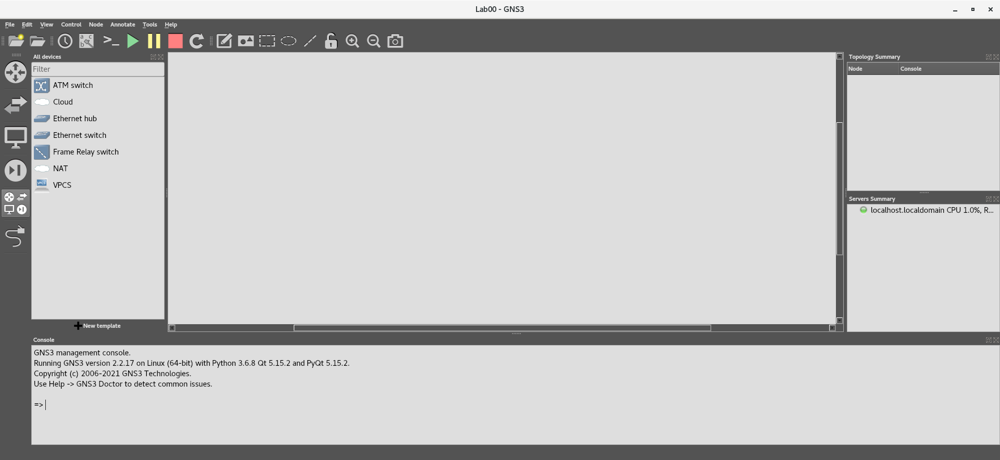
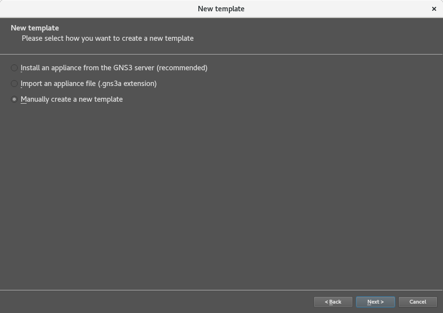
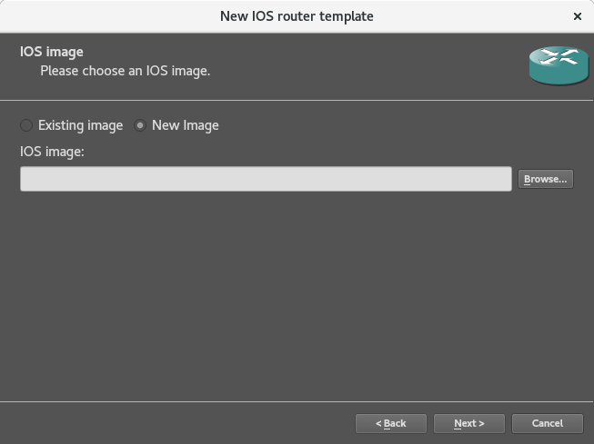
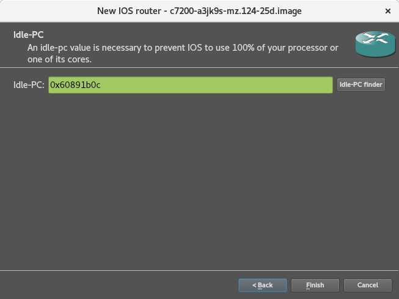
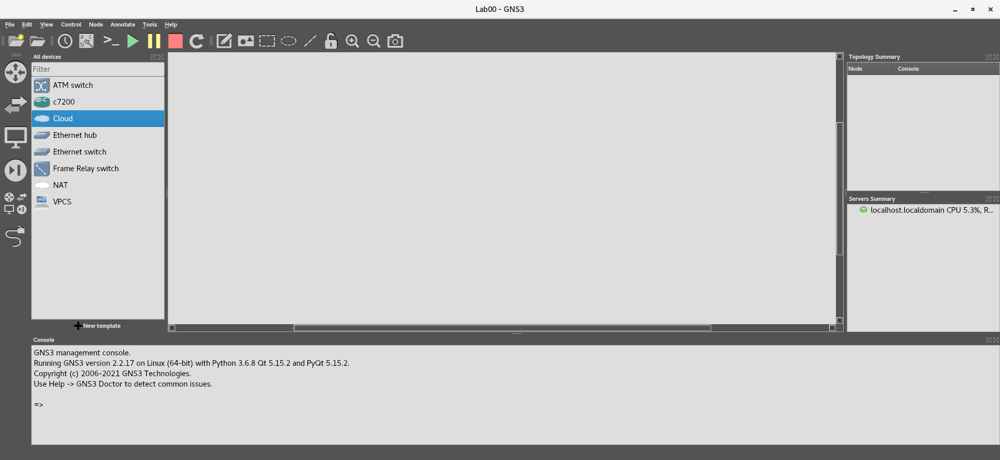
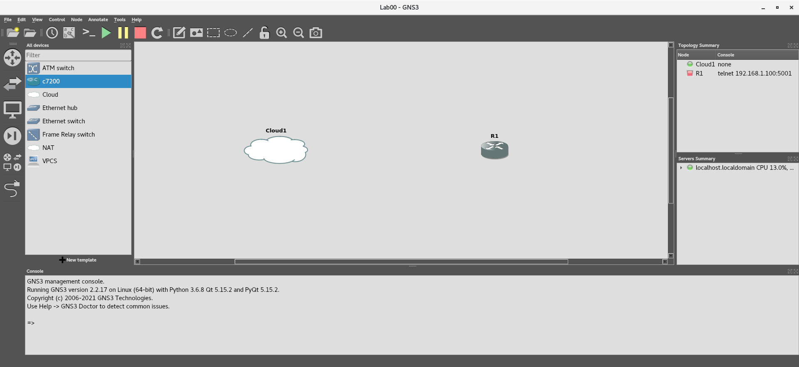
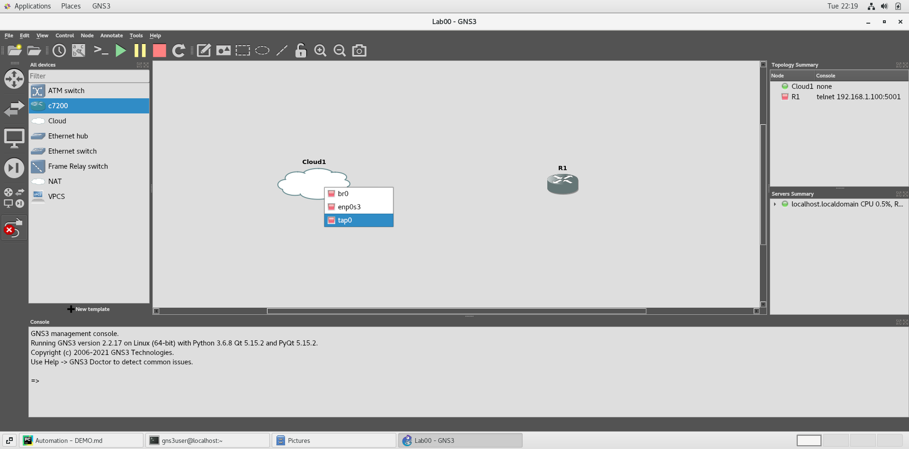
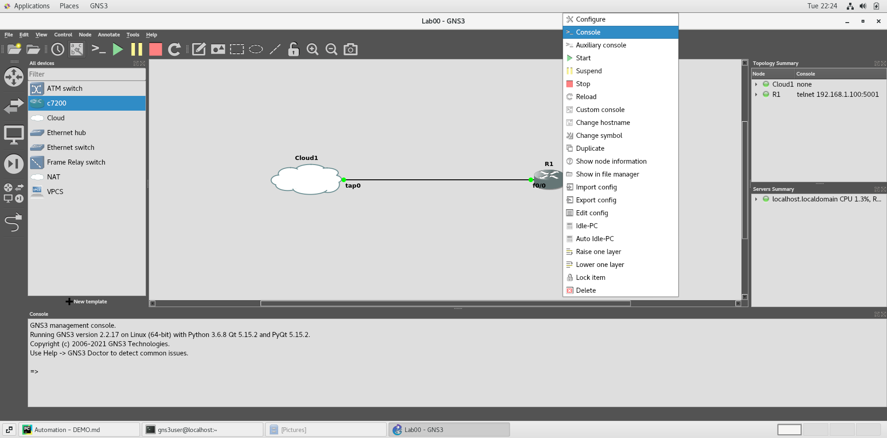
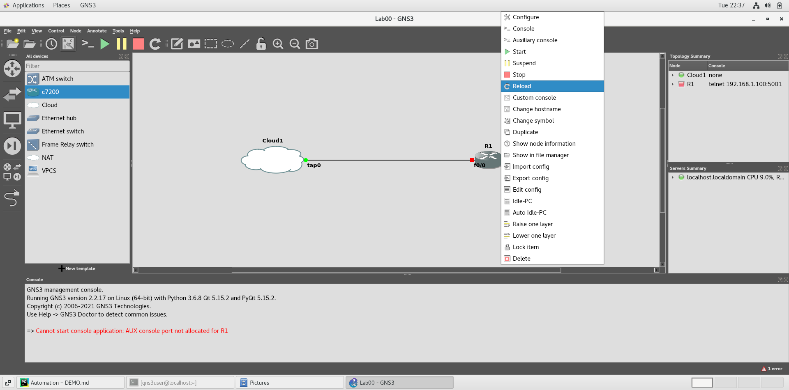

# Lab 00 - Demo

This demo/tutorial walks through all the steps to create a lab in GNS3 and to configure a device using Python automation.

>**Note** - If you are unfamiliar with GNS3, visit [https://docs.gns3.com/docs/using-gns3/beginners/the-gns3-gui/](https://docs.gns3.com/docs/using-gns3/beginners/the-gns3-gui/ "The GNS3 GUI") for a great introduction to the GNS3 Graphical User Interface (GUI).

1. Start GNS3 by opening a terminal and executing the "./gns3_run.sh" bash script.
2. When the **Project** window appears, select the **New Project** tab. Enter "Lab00" in the **Name:** textbox and click **OK**. If the **Project** window does not appear, click on **File -> New blank project** or **[CTRL]+[N]** .
   


3. In the **Devices Toolbar** (on the left), click on **New template**, or select **File -> New template** from the top menu:



4. 



5.


6.



7.


8.


9.


10.


11.


12.


13.


14.


15.


16.



17.


18. In the **Devices Toolbar** (on the left), click on the **Browse all devices** icon and select **Cloud**:
   


19. Drag a cloud device into the **Workspace**. This is your host machine:


20. Select and drag a Cisco 3745 Multiservice Access Router (**c3745**) into the **Workspace**:



21. In the **Devices Toolbar** (on the left), click on the **Add a link** icon. Click on **Cloud1** and connect one end of the link to **tap0**:



22. Click on **R1** and connect the other end of the link to **FastEthernet0/0**:


>**Note** - To quickly identify nodes in the **Workspace**, click on the **Show/Hide interface labels** icon in the top **Toolbar**, or select **View -> Show/Hide interface labels** from the top menu.

23. Right click on **R1** and **Start** the device (You can also start all the devices using the green **Start** icon in the top **Toolbar**):


24. Right click on **R1** again to open a **Console**:



25. When the **Console** window appears, press **[Enter]** and wait for the prompt to appear:


>**Note** - If the prompt reads ```R1>```, you are in **User EXEC Mode**. Enter ```enable``` at the prompt to enter **Priviledged EXEC Mode** (i.e., ```R1>enable```).

26. Enter the following commands to reset the device (Press **[ENTER]** at the ```[confirm]``` prompts):

    
    R1#write erase
    Erasing the nvram filesystem will remove all configuration files! Continue? [confirm]
    [OK]
    Erase of nvram: complete
    R1#
    *Feb 24 03:42:43.875: %SYS-7-NV_BLOCK_INIT: Initialized the geometry of nvram
    R1#reload
    Proceed with reload? [confirm]
    
    *Feb 24 03:42:54.111: %SYS-5-RELOAD: Reload requested by console. Reload Reason: Reload Command.
    ROM: reload requested...

27. Close the **Console** window. Right click on **R1** again and **Stop** the device:
    
>**Note** - Normally, you would enter ```reload``` at the prompt to reload the device. However, do not do this; GNS3 may crash.


28. Right click on **R1** again and **Reload**. The device should start automatically:



29. Right click on **R1** again and reopen open a **Console**. This Cisco device stores its configuration settings in non-volatile RAM, known as NVRAM. Enter the following command to look at the contents of the NVRAM:

        R1#show startup-config
        Using 404 out of 155640 bytes!
        !
        !
        service timestamps debug datetime msec
        service timestamps log datetime msec
        no service password-encryption
        !
        hostname R1
        !
        ip cef
        no ip domain-lookup
        no ip icmp rate-limit unreachable
        ip tcp synwait 5
        no cdp log mismatch duplex
        !
        line con 0
         exec-timeout 0 0
         logging synchronous
         privilege level 15
         no login
        line aux 0
         exec-timeout 0 0
         logging synchronous
         privilege level 15
         no login
        !
        !
        end
        
        R1#

30. Compare this to the running-config, which is built when the device starts and is stored in the device's volatile RAM:

        R1#show running-config
        Building configuration...
        
        Current configuration : 1932 bytes
        !
        version 12.4
        service timestamps debug datetime msec
        service timestamps log datetime msec
        no service password-encryption
        !
        hostname R1
        !
        boot-start-marker
        boot-end-marker
        !
        !
        no aaa new-model
        memory-size iomem 5
        no ip icmp rate-limit unreachable
        ip cef
        !
        !
        !
        !
        no ip domain lookup
        ip auth-proxy max-nodata-conns 3
        ip admission max-nodata-conns 3
        !
        !
        !
        !
        !
        !
        !
        !
        !
        !
        !
        !
        !
        !
        !
        !
        !
        !
        !
        ip tcp synwait-time 5
        ! 
        !         
        !
        !
        !
        interface FastEthernet0/0
         no ip address
         shutdown
         duplex auto
         speed auto
        !
        interface Serial0/0
         no ip address
         shutdown
         clock rate 2000000
        !
        interface FastEthernet0/1
         no ip address
         shutdown
         duplex auto
         speed auto
        !
        interface Serial0/1
         no ip address
         shutdown 
         clock rate 2000000
        !
        interface Serial0/2
         no ip address
         shutdown
         clock rate 2000000
        !
        interface FastEthernet1/0
         no ip address
         shutdown
         duplex auto
         speed auto
        !
        interface Serial2/0
         no ip address
         shutdown
         serial restart-delay 0
        !
        interface Serial2/1
         no ip address
         shutdown
         serial restart-delay 0
        !         
        interface Serial2/2
         no ip address
         shutdown
         serial restart-delay 0
        !
        interface Serial2/3
         no ip address
         shutdown
         serial restart-delay 0
        !
        interface FastEthernet3/0
        !
        interface FastEthernet3/1
        !
        interface FastEthernet3/2
        !
        interface FastEthernet3/3
        !
        interface FastEthernet3/4
        !
        interface FastEthernet3/5
        !
        interface FastEthernet3/6
        !
        interface FastEthernet3/7
        !
        interface FastEthernet3/8
        !
        interface FastEthernet3/9
        !
        interface FastEthernet3/10
        !
        interface FastEthernet3/11
        !
        interface FastEthernet3/12
        !
        interface FastEthernet3/13
        !
        interface FastEthernet3/14
        !
        interface FastEthernet3/15
        !
        interface Vlan1
         no ip address
        !
        ip forward-protocol nd
        !
        !
        no ip http server
        no ip http secure-server
        !
        no cdp log mismatch duplex
        !
        !
        !
        control-plane
        !
        !
        !
        !
        !
        !
        !
        !
        !
        !
        line con 0
         exec-timeout 0 0
         privilege level 15
         logging synchronous
        line aux 0
         exec-timeout 0 0
         privilege level 15
         logging synchronous
        line vty 0 4
         login
        !
        !
        end

31. 

R1#configure terminal ! Enter Global Configuration Mode
R1(config)#interface FastEthernet 0/0 ! Enter Interface Configuration Mode
R1(config-if)#ip address 192.168.1.10 255.255.255.0 ! Set the IP address of the router
R1(config-if)#no shutdown ! Bring up the interface
R1(config-if)#exit ! Exit Interface Configuration Mode
R1(config)# ip route 0.0.0.0 0.0.0.0 192.168.1.100 ! Configure the default gateway
R1(config)# end ! Exit Global Configuration Mode
R1#
*Mar  1 00:13:00.067: %SYS-5-CONFIG_I: Configured from memory by console

Ping the router’s default gateway:
Copy
R1# ping 192.168.1.100

Type escape sequence to abort.
Sending 5, 100-byte ICMP Echos to 192.168.1.100, timeout is 2 seconds:
.!!!!
Success rate is 80 percent (4/5), round-trip min/avg/max = 32/36/40 ms
R1#

R1#write memory ! Save the new configuration to flash memory
Building configuration...
[OK]
R1#

Now look at the new and current configuration of the router
R1#show running-config
Building configuration...

Current configuration :
...
end

#R1

Compare to the startup configuration settings in the NVRAM:
#R1show startup-config
Using 1985 out of 155640 bytes
...
end

R1#

Now copy the current settings to the NVRAM. At the "Destination filename" prompt, press [ENTER] or input "startup-config":
R1#copy running-config startup-config
Destination filename [startup-config]?
Building configuration...
[OK]
R1#